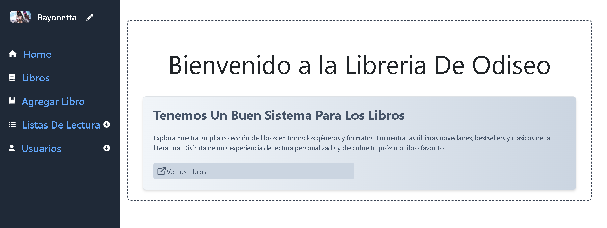
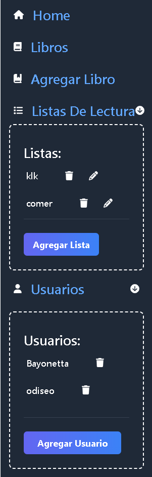
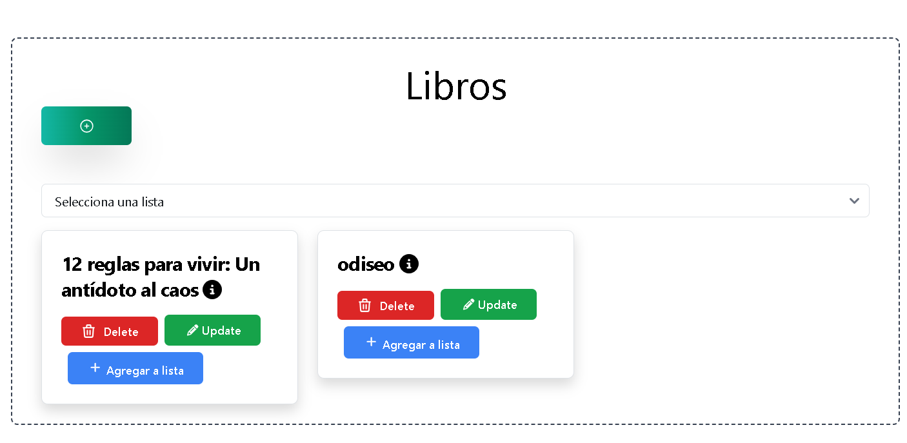
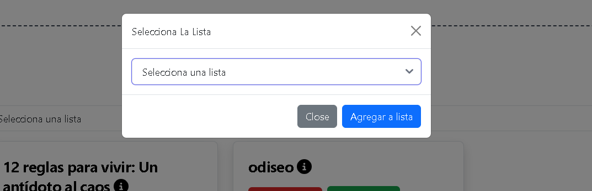
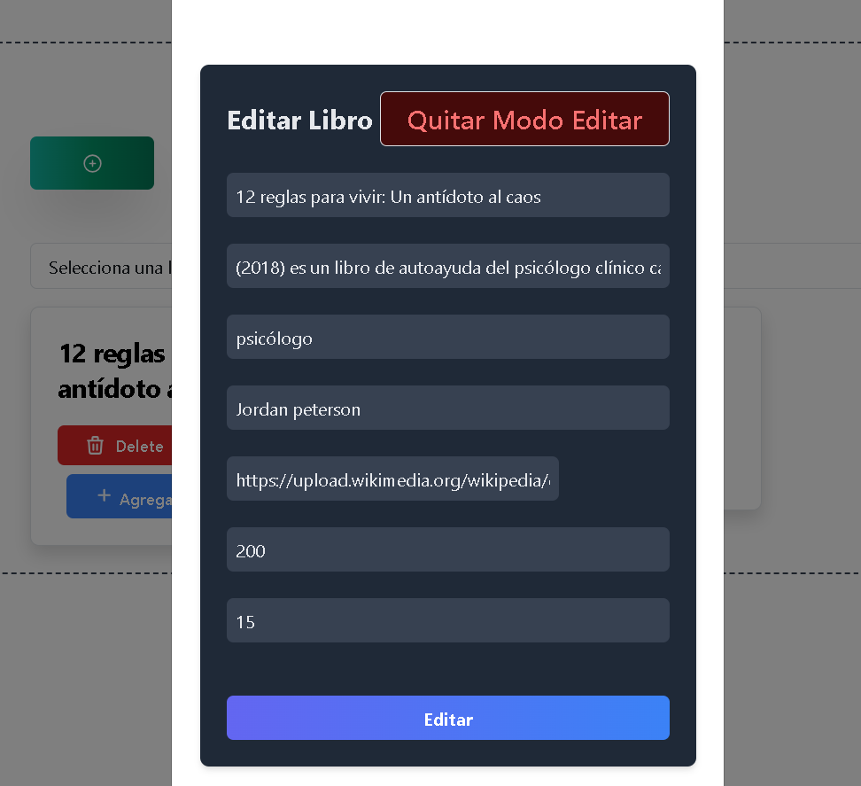

# Libreria

## Que es esto:
este es un proyecto que esta basado en una libreria, que tiene las siguientes funcionalidades:

**CRUD de los libros (Obviamente)** : usted podra agregar eliminar, editar y ver todos los libros que usted tiene agregado ademas

**Listas De Lectura:** ademas de ser el tipico CRUD le agregue la funcionalidad de "listas de lectura" en donde usted podra crear una lista desde el sidebar y poner los libros que quiera en esa lista desde la vista de libros y poder ver los libros de esa lista desde la misma vista de libros

**Cambio de Usuario:** como a todo el mundo le molestar tener que estar iniciando sesion,le agrege la funcionalidad de que puedes agregar un usuario y acceder a el desde el sidebar sin tener que poner ninguna clave,
Cada usuario tiene sus listas y libros, osea que si agrega un libro estando en sesion el usuario "Donald trump" se le asociara ese libro a ese usuario al igual que con las listas

> [!IMPORTANT]  
> Cada usuario tiene sus listas y libros, osea que si agrega un libro estando en sesion el usuario "Donald trump" se le asociara ese libro a ese usuario al igual que con las listas

Las entidades en la base de datos son:
1-ListaDeLectura
2-Usuario
3-Libro

## Imagenes:
Dashboard

este es el sidebar en donde se ve los usuarios y las Lista De Lectura

libros

Pasar un libro a una lista de lectura

Editar Libro

Detalle de un libro 

